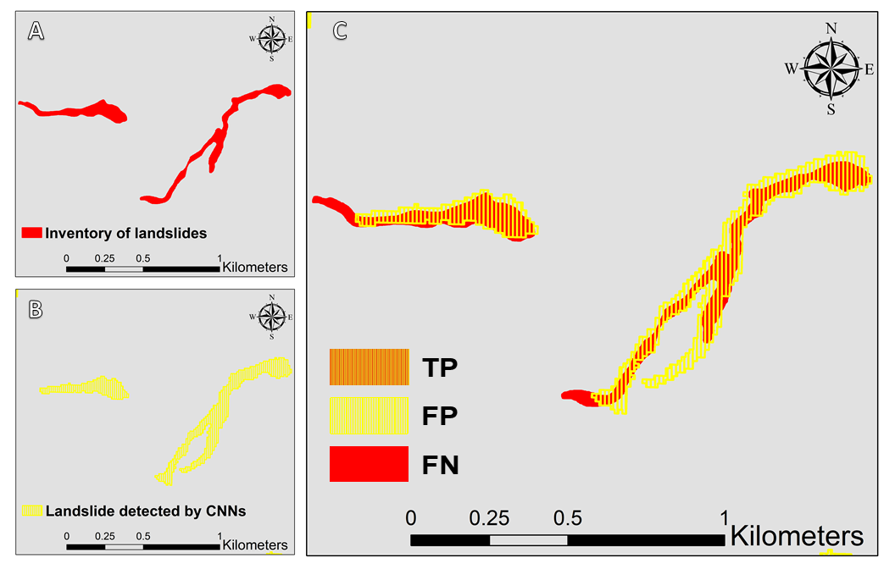

Automated landslide detection using deep learning approach a case study of Kodagu, Western Ghats.

## Visualisation

For our work visualising the CNN detected landslides polygons along with manual polygons is important. Apart from that visualisation of factor maps and study area map is also crucial for informing the reader about the study area loaction and datasets used.  

For example: visualising  landslide detection validation results using  CNN approach.Here most important is visual differenciation of logygon colours.

## Reproducibility

In terms of reproducibility of our work, methodology can be reproducible as we have described the workflow of CNN architecture.However, we used commercial planetscope satellite imagery, so in order to reproduce the same work in the following study area user have to pay for the planetscope data.

Also, the landslide inventory data for training the CNNs is prepared manually and can be provided as supplimentory data.

## science communication
Related to our work we have added the content of the exercise.

1.	Who are the intended readers?

People working on landslide research in India, specifically geological survey of India officials, National disaster management authority.
Scientific community working on landslide research such as university professors and students. 
People who are working on hazard mitigation and relief work.

2.	What did you do?

The main aim of the present study is to rapidly map landslides using convolutional neural networks (CNNs) to support disaster response. In this regard, we present remote sensing (RS) approach based on optical satellite imagery from the PlanetScope sensor and topographical factor prepared from a 12.5 m resolution digital elevation model (DEM) acquired from the Japanese aerospace exploration agency JAXA ALOS sensor to detect the landslides using a CNN model.

3.	Why did you do?

In the landslide affected region, damage assessment and rescue operations were hampered by the lack of landslide location information. So we decided to use automated CNNs to map landslide rapidly to support relief work. Literature review shows that the potential of CNN models for landslide detection has not been fully explored yet. Further, our study can be considered as the first study using the CNN model for detection of landslides in the hills of Western Ghats . Our remote sensing approach is based on optical satellite imagery and digital elevation data using the CNN model for landslide detection. In the present study, we compare the CNN results generated from different training datasets with a precise landslide inventory of polygons using the K-fold cross validation method. 

4.	What happened [when you did that]?

We were able to detect landslides using CNNs using an automated approach, results show that there are spatial fits between landslides detected using CNNs and manual mapping that took us a lot of time and effort. 

5.	What do the results mean in theory?

In theory we should be able to detect objects using CNNs with least accuracy of 60% in F1 measure. 

6.	What do the results mean in practice?

In practice we were able to achieve better results than expected with overall accuracy of 68% in F-score. 

7.	What is the key benefit for readers?

The detected landslide polygon information can be used for disaster planning, mitigation measures for the affected areas. They will gain knowledge about landslides information in the affected areas, and about the methodology.

8.	What remains unresolved?

We still want to improve the overall accuracy and delineation of landslides near the riverbed. There are still some false positives.

License:CC-BY-4.0